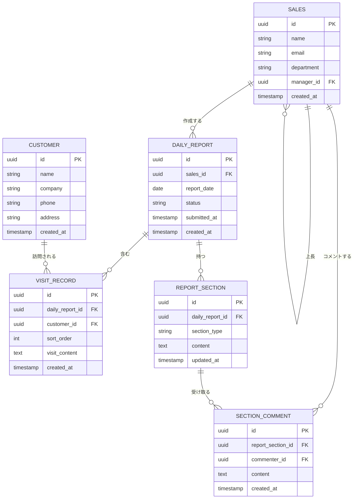

```mermaid
erDiagram
  SALES {
    uuid id PK
    string name
    string email
    string department
    uuid manager_id FK
    timestamp created_at
  }

  CUSTOMER {
    uuid id PK
    string name
    string company
    string phone
    string address
    timestamp created_at
  }

  DAILY_REPORT {
    uuid id PK
    uuid sales_id FK
    date report_date
    string status
    timestamp submitted_at
    timestamp created_at
  }

  VISIT_RECORD {
    uuid id PK
    uuid daily_report_id FK
    uuid customer_id FK
    int sort_order
    text visit_content
    timestamp created_at
  }

  REPORT_SECTION {
    uuid id PK
    uuid daily_report_id FK
    string section_type
    text content
    timestamp updated_at
  }

  SECTION_COMMENT {
    uuid id PK
    uuid report_section_id FK
    uuid commenter_id FK
    text content
    timestamp created_at
  }

  SALES ||--o{ DAILY_REPORT : "作成する"
  SALES ||--o{ SALES : "上長"
  SALES ||--o{ SECTION_COMMENT : "コメントする"
  DAILY_REPORT ||--o{ VISIT_RECORD : "含む"
  DAILY_REPORT ||--o{ REPORT_SECTION : "持つ"
  CUSTOMER ||--o{ VISIT_RECORD : "訪問される"
  REPORT_SECTION ||--o{ SECTION_COMMENT : "受け取る"
```
