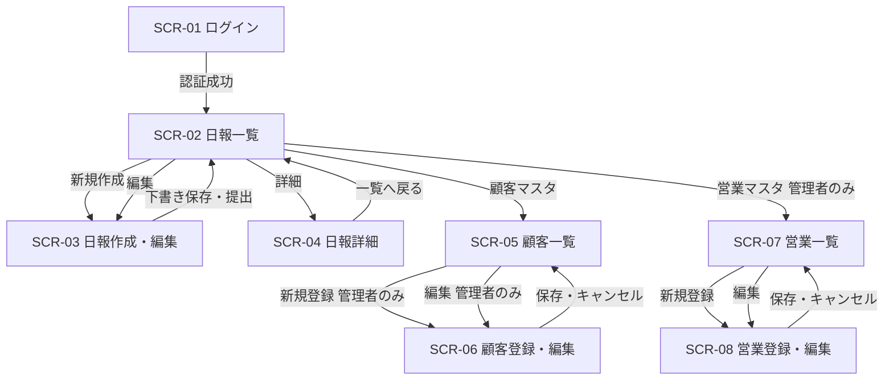

# 営業日報システム — 画面定義書

---

## 目次

1. [画面一覧](#1-画面一覧)
2. [SCR-01 ログイン画面](#2-scr-01-ログイン画面)
3. [SCR-02 日報一覧画面](#3-scr-02-日報一覧画面)
4. [SCR-03 日報作成・編集画面](#4-scr-03-日報作成編集画面)
5. [SCR-04 日報詳細画面](#5-scr-04-日報詳細画面)
6. [SCR-05 顧客マスタ一覧画面](#6-scr-05-顧客マスタ一覧画面)
7. [SCR-06 顧客マスタ登録・編集画面](#7-scr-06-顧客マスタ登録編集画面)
8. [SCR-07 営業マスタ一覧画面](#8-scr-07-営業マスタ一覧画面)
9. [SCR-08 営業マスタ登録・編集画面](#9-scr-08-営業マスタ登録編集画面)

---

## 1. 画面一覧

| 画面ID | 画面名 | 対象ロール | 概要 |
|--------|--------|-----------|------|
| SCR-01 | ログイン画面 | 全員 | メールアドレス・パスワードでログイン |
| SCR-02 | 日報一覧画面 | 全員 | 自分の日報一覧（上長は部下の一覧も閲覧可） |
| SCR-03 | 日報作成・編集画面 | 営業 | 日報の新規作成・下書き編集・提出 |
| SCR-04 | 日報詳細画面 | 全員 | 日報の閲覧・上長コメント入力 |
| SCR-05 | 顧客マスタ一覧画面 | 全員 | 顧客の検索・一覧表示 |
| SCR-06 | 顧客マスタ登録・編集画面 | 管理者 | 顧客情報の新規登録・編集 |
| SCR-07 | 営業マスタ一覧画面 | 管理者 | 営業担当者の一覧表示 |
| SCR-08 | 営業マスタ登録・編集画面 | 管理者 | 営業担当者の新規登録・編集 |

### ロール定義

| ロール | 説明 |
|--------|------|
| 営業 | 日報を作成・提出する一般ユーザー |
| 上長 | 部下の日報を閲覧しコメントできるユーザー |
| 管理者 | マスタ管理を含む全機能にアクセスできるユーザー |

---

## 2. SCR-01 ログイン画面

### 基本情報

| 項目 | 内容 |
|------|------|
| 画面ID | SCR-01 |
| 画面名 | ログイン画面 |
| URL | `/login` |
| 対象ロール | 全員（未認証） |

### 画面レイアウト

```
┌─────────────────────────────────┐
│         営業日報システム          │
│                                 │
│  メールアドレス                  │
│  [________________________]     │
│                                 │
│  パスワード                      │
│  [________________________]     │
│                                 │
│  [      ログイン      ]          │
└─────────────────────────────────┘
```

### 入力項目

| 項目名 | 型 | 必須 | バリデーション |
|--------|----|------|---------------|
| メールアドレス | text | ○ | メール形式 |
| パスワード | password | ○ | 8文字以上 |

### アクション

| アクション | 処理内容 | 遷移先 |
|-----------|---------|--------|
| ログインボタン押下 | 認証処理。成功時はセッション生成 | SCR-02（日報一覧） |

### エラー表示

| 条件 | メッセージ |
|------|-----------|
| 認証失敗 | メールアドレスまたはパスワードが正しくありません |
| 未入力 | 必須項目を入力してください |

---

## 3. SCR-02 日報一覧画面

### 基本情報

| 項目 | 内容 |
|------|------|
| 画面ID | SCR-02 |
| 画面名 | 日報一覧画面 |
| URL | `/reports` |
| 対象ロール | 全員 |

### 画面レイアウト

```
┌─────────────────────────────────────────────────────┐
│ 営業日報システム          [山田 太郎 ▼]  [ログアウト] │
├─────────────────────────────────────────────────────┤
│ 日報一覧                         [＋ 新規作成]       │
│                                                     │
│ 担当者 [________▼]  期間 [____]〜[____]  [検索]      │
│ ※上長・管理者のみ担当者フィルター表示               │
├──────┬────────────┬──────────┬────────┬─────────────┤
│ 日付 │ 担当者     │ 訪問件数 │ ステータス │ 操作    │
├──────┼────────────┼──────────┼────────┼─────────────┤
│ 4/1  │ 山田 太郎  │ 3件      │ 提出済み  │ [詳細]  │
│ 3/31 │ 山田 太郎  │ 2件      │ 確認済み  │ [詳細]  │
│ 3/30 │ 山田 太郎  │ 4件      │ 下書き    │ [編集]  │
└──────┴────────────┴──────────┴────────┴─────────────┘
│  < 前へ  1  2  3  次へ >                            │
└─────────────────────────────────────────────────────┘
```

### 表示項目

| 項目名 | 内容 |
|--------|------|
| 日付 | 日報の対象日 |
| 担当者 | 作成した営業担当者名（上長・管理者のみ表示） |
| 訪問件数 | VISIT_RECORD の件数 |
| ステータス | `下書き` / `提出済み` / `確認済み` |
| 操作 | ステータスが下書きの場合は「編集」、それ以外は「詳細」 |

### 検索・フィルター

| 項目名 | 型 | 説明 |
|--------|----|------|
| 担当者 | セレクトボックス | 上長・管理者のみ表示。自分の部下一覧から選択 |
| 期間（開始） | 日付 | 対象日の絞り込み開始日 |
| 期間（終了） | 日付 | 対象日の絞り込み終了日 |

### アクション

| アクション | 処理内容 | 遷移先 |
|-----------|---------|--------|
| 新規作成ボタン | 当日の日報が未作成であれば新規作成画面へ | SCR-03 |
| 詳細ボタン | 選択した日報の詳細を表示 | SCR-04 |
| 編集ボタン | 下書き日報の編集画面を表示 | SCR-03 |

---

## 4. SCR-03 日報作成・編集画面

### 基本情報

| 項目 | 内容 |
|------|------|
| 画面ID | SCR-03 |
| 画面名 | 日報作成・編集画面 |
| URL | `/reports/new` / `/reports/:id/edit` |
| 対象ロール | 営業 |

### 画面レイアウト

```
┌──────────────────────────────────────────────────────┐
│ 営業日報システム           [山田 太郎 ▼] [ログアウト] │
├──────────────────────────────────────────────────────┤
│ 日報作成                                             │
│ 対象日: 2025年4月1日（火）                           │
│                                                      │
│ ■ 訪問記録                           [＋ 行を追加]  │
│ ┌────┬────────────────────┬──────────────────────┐  │
│ │ # │ 顧客名              │ 訪問内容             │  │
│ ├────┼────────────────────┼──────────────────────┤  │
│ │ 1 │ [株式会社〇〇    ▼] │ [________________]   │  │
│ │   │                    │ [削除]               │  │
│ ├────┼────────────────────┼──────────────────────┤  │
│ │ 2 │ [___________     ▼] │ [________________]   │  │
│ │   │                    │ [削除]               │  │
│ └────┴────────────────────┴──────────────────────┘  │
│                                                      │
│ ■ 今日の課題・相談 (Problem)                         │
│ ┌──────────────────────────────────────────────────┐ │
│ │                                                  │ │
│ │                                                  │ │
│ └──────────────────────────────────────────────────┘ │
│                                                      │
│ ■ 明日やること (Plan)                                │
│ ┌──────────────────────────────────────────────────┐ │
│ │                                                  │ │
│ │                                                  │ │
│ └──────────────────────────────────────────────────┘ │
│                                                      │
│          [下書き保存]        [提出する]              │
└──────────────────────────────────────────────────────┘
```

### 入力項目

#### 訪問記録（複数行）

| 項目名 | 型 | 必須 | バリデーション |
|--------|----|------|---------------|
| 顧客名 | セレクトボックス | ○ | 顧客マスタから選択 |
| 訪問内容 | テキストエリア | ○ | 最大1000文字 |

- 初期表示は1行。「行を追加」ボタンで行を増やせる。
- 「削除」ボタンで行を削除できる（最低1行は必須）。

#### Problem / Plan

| 項目名 | 型 | 必須 | バリデーション |
|--------|----|------|---------------|
| 今日の課題・相談（Problem） | テキストエリア | △ | 最大2000文字 |
| 明日やること（Plan） | テキストエリア | △ | 最大2000文字 |

※ 下書き保存時は任意。提出時は両方必須。

### アクション

| アクション | 処理内容 | 遷移先 |
|-----------|---------|--------|
| 下書き保存 | ステータス `draft` で保存 | SCR-02（一覧） |
| 提出する | バリデーション後、ステータス `submitted` に更新 | SCR-04（詳細） |
| 行を追加 | 訪問記録に新しい行を追加（画面内処理） | — |
| 削除 | 対象の訪問記録行を削除（画面内処理） | — |

### エラー表示

| 条件 | メッセージ |
|------|-----------|
| 顧客未選択で提出 | 顧客を選択してください |
| 訪問内容未入力で提出 | 訪問内容を入力してください |
| Problem未入力で提出 | 課題・相談を入力してください |
| Plan未入力で提出 | 明日やることを入力してください |
| 同日の日報が既に存在 | この日付の日報はすでに作成されています |

---

## 5. SCR-04 日報詳細画面

### 基本情報

| 項目 | 内容 |
|------|------|
| 画面ID | SCR-04 |
| 画面名 | 日報詳細画面 |
| URL | `/reports/:id` |
| 対象ロール | 全員 |

### 画面レイアウト

```
┌──────────────────────────────────────────────────────┐
│ 営業日報システム           [山田 太郎 ▼] [ログアウト] │
├──────────────────────────────────────────────────────┤
│ ← 一覧へ戻る                                         │
│                                                      │
│ 2025年4月1日（火）の日報  山田 太郎  [提出済み]       │
│                                                      │
│ ■ 訪問記録                                          │
│ ┌────┬───────────────┬────────────────────────────┐  │
│ │ # │ 顧客名         │ 訪問内容                   │  │
│ ├────┼───────────────┼────────────────────────────┤  │
│ │ 1 │ 株式会社〇〇   │ 新製品の提案を実施。前向き  │  │
│ │   │               │ な反応あり。次回見積提出へ  │  │
│ ├────┼───────────────┼────────────────────────────┤  │
│ │ 2 │ △△商事        │ 定期訪問。担当者変更の連絡  │  │
│ └────┴───────────────┴────────────────────────────┘  │
│                                                      │
│ ■ 今日の課題・相談 (Problem)                         │
│ ┌──────────────────────────────────────────────────┐ │
│ │ 競合他社の価格が下がっており、提案が難しい。      │ │
│ └──────────────────────────────────────────────────┘ │
│ 上長コメント ※上長・管理者のみ表示                  │
│ ┌──────────────────────────────────────────────────┐ │
│ │ [コメントを入力...                             ]  │ │
│ └──────────────────────────────────────────────────┘ │
│ [田中 部長 2025/04/02] 価格交渉の余地があるか確認を  │
│                                                      │
│ ■ 明日やること (Plan)                                │
│ ┌──────────────────────────────────────────────────┐ │
│ │ 株式会社〇〇向けに見積書を作成して送付する。      │ │
│ └──────────────────────────────────────────────────┘ │
│ 上長コメント ※上長・管理者のみ表示                  │
│ ┌──────────────────────────────────────────────────┐ │
│ │ [コメントを入力...                             ]  │ │
│ └──────────────────────────────────────────────────┘ │
│                                                      │
│ ※上長・管理者のみ表示                               │
│          [確認済みにする]                            │
└──────────────────────────────────────────────────────┘
```

### 表示項目

| 項目名 | 表示条件 |
|--------|---------|
| 対象日・担当者・ステータス | 全員 |
| 訪問記録（顧客・内容） | 全員 |
| Problem・Plan テキスト | 全員 |
| 上長コメント入力欄 | 上長・管理者のみ |
| 既存コメント一覧 | 全員（誰でも閲覧可） |
| 確認済みにするボタン | 上長・管理者のみ、ステータスが `submitted` の場合 |

### アクション

| アクション | 処理内容 | 遷移先 |
|-----------|---------|--------|
| コメント送信 | SECTION_COMMENT を新規登録 | 同画面リロード |
| 確認済みにする | ステータスを `confirmed` に更新 | 同画面リロード |
| 一覧へ戻る | — | SCR-02 |

---

## 6. SCR-05 顧客マスタ一覧画面

### 基本情報

| 項目 | 内容 |
|------|------|
| 画面ID | SCR-05 |
| 画面名 | 顧客マスタ一覧画面 |
| URL | `/customers` |
| 対象ロール | 全員（編集・登録は管理者のみ） |

### 画面レイアウト

```
┌──────────────────────────────────────────────────────┐
│ 営業日報システム           [山田 太郎 ▼] [ログアウト] │
├──────────────────────────────────────────────────────┤
│ 顧客マスタ                   ※[＋ 新規登録]（管理者） │
│                                                      │
│ 顧客名・会社名 [________________]  [検索]            │
│                                                      │
│ ┌──────────────────┬──────────────┬────────┬──────┐  │
│ │ 顧客名            │ 会社名       │ 電話番号│ 操作 │  │
│ ├──────────────────┼──────────────┼────────┼──────┤  │
│ │ 田中 一郎         │ 株式会社〇〇  │ 03-... │[編集]│  │
│ │ 鈴木 花子         │ △△商事      │ 06-... │[編集]│  │
│ └──────────────────┴──────────────┴────────┴──────┘  │
└──────────────────────────────────────────────────────┘
```

### 表示項目

| 項目名 | 内容 |
|--------|------|
| 顧客名 | 担当者名 |
| 会社名 | 所属会社 |
| 電話番号 | 連絡先 |
| 操作 | 管理者のみ「編集」ボタンを表示 |

### アクション

| アクション | 処理内容 | 遷移先 |
|-----------|---------|--------|
| 新規登録（管理者のみ） | — | SCR-06（新規） |
| 編集（管理者のみ） | — | SCR-06（編集） |
| 検索 | 顧客名・会社名の部分一致検索 | 同画面 |

---

## 7. SCR-06 顧客マスタ登録・編集画面

### 基本情報

| 項目 | 内容 |
|------|------|
| 画面ID | SCR-06 |
| 画面名 | 顧客マスタ登録・編集画面 |
| URL | `/customers/new` / `/customers/:id/edit` |
| 対象ロール | 管理者 |

### 入力項目

| 項目名 | 型 | 必須 | バリデーション |
|--------|----|------|---------------|
| 顧客名 | テキスト | ○ | 最大100文字 |
| 会社名 | テキスト | ○ | 最大200文字 |
| 電話番号 | テキスト | — | 電話番号形式 |
| 住所 | テキスト | — | 最大300文字 |

### アクション

| アクション | 処理内容 | 遷移先 |
|-----------|---------|--------|
| 保存 | 新規登録または更新 | SCR-05（一覧） |
| キャンセル | 変更を破棄 | SCR-05（一覧） |

---

## 8. SCR-07 営業マスタ一覧画面

### 基本情報

| 項目 | 内容 |
|------|------|
| 画面ID | SCR-07 |
| 画面名 | 営業マスタ一覧画面 |
| URL | `/sales` |
| 対象ロール | 管理者 |

### 画面レイアウト

```
┌──────────────────────────────────────────────────────┐
│ 営業日報システム           [管理者 ▼]  [ログアウト]  │
├──────────────────────────────────────────────────────┤
│ 営業マスタ                          [＋ 新規登録]    │
│                                                      │
│ ┌──────────┬──────────────────┬──────────┬────────┐  │
│ │ 氏名      │ メールアドレス    │ 上長     │ 操作   │  │
│ ├──────────┼──────────────────┼──────────┼────────┤  │
│ │ 山田 太郎 │ yamada@...       │ 田中 部長 │ [編集] │  │
│ │ 佐藤 次郎 │ sato@...         │ 田中 部長 │ [編集] │  │
│ │ 田中 部長 │ tanaka@...       │ —        │ [編集] │  │
│ └──────────┴──────────────────┴──────────┴────────┘  │
└──────────────────────────────────────────────────────┘
```

### アクション

| アクション | 処理内容 | 遷移先 |
|-----------|---------|--------|
| 新規登録 | — | SCR-08（新規） |
| 編集 | — | SCR-08（編集） |

---

## 9. SCR-08 営業マスタ登録・編集画面

### 基本情報

| 項目 | 内容 |
|------|------|
| 画面ID | SCR-08 |
| 画面名 | 営業マスタ登録・編集画面 |
| URL | `/sales/new` / `/sales/:id/edit` |
| 対象ロール | 管理者 |

### 入力項目

| 項目名 | 型 | 必須 | バリデーション |
|--------|----|------|---------------|
| 氏名 | テキスト | ○ | 最大100文字 |
| メールアドレス | テキスト | ○ | メール形式・重複不可 |
| 部署 | テキスト | — | 最大100文字 |
| 上長 | セレクトボックス | — | 営業マスタから選択（自分自身は選択不可） |
| パスワード | パスワード | ○（新規時） | 8文字以上（編集時は空白で変更なし） |

### アクション

| アクション | 処理内容 | 遷移先 |
|-----------|---------|--------|
| 保存 | 新規登録または更新 | SCR-07（一覧） |
| キャンセル | 変更を破棄 | SCR-07（一覧） |

---

## 画面遷移図


